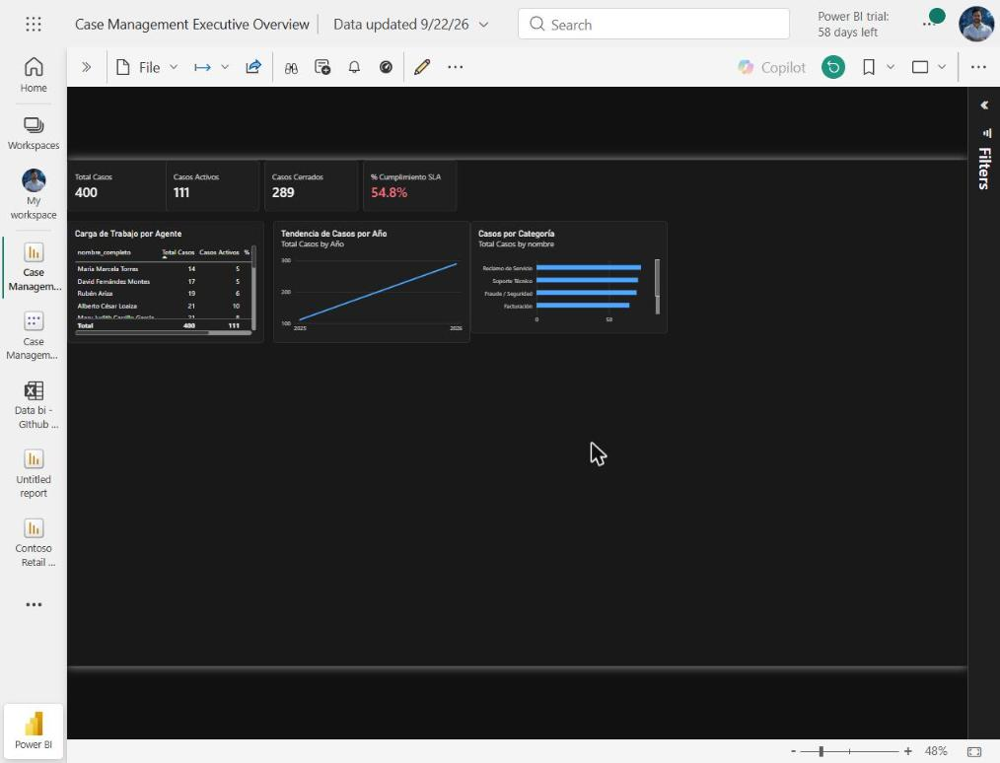
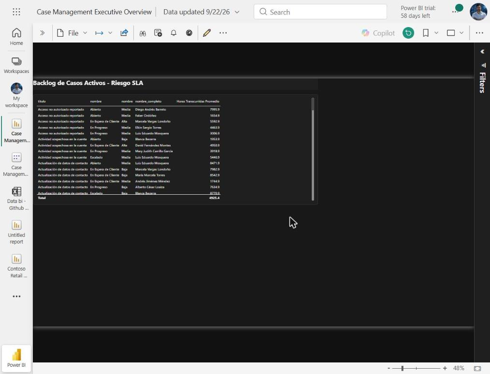

# Case Management System – Proyecto de Portafolio

Dashboard ejecutivo en Power BI Service para un sistema sintético de gestión de casos de soporte (tickets), con modelado dimensional, medidas DAX y una vista operativa de backlog/riesgo de SLA. Proyecto de portafolio (no un sistema en producción), en la misma línea que [Contoso Retail Executive Overview](../contoso-retail-executive-overview).

## Objetivo

Simular el sistema de tickets de un equipo de soporte y responder tres preguntas de negocio:

- ¿Cuántos casos hay abiertos y cerrados?
- ¿Se está cumpliendo el SLA acordado por prioridad?
- ¿Cómo está distribuida la carga de trabajo entre agentes?

## Arquitectura de datos

Modelo semántico en esquema estrella con 8 tablas: 2 de hechos y 6 dimensiones.

| Tabla | Tipo | Contenido |
|---|---|---|
| `fact_caso` | Hecho | Un registro por caso: fechas de creación/cierre, horas transcurridas, prioridad, categoría, estado, agente asignado |
| `fact_comentario` | Hecho | Interacciones/comentarios asociados a cada caso |
| `fact_historial_estado` | Hecho | Historial de cambios de estado por caso |
| `dim_estado` | Dimensión | Estados del caso (nuevo, en progreso, cerrado, etc.) con bandera de estado final |
| `dim_prioridad` | Dimensión | Niveles de prioridad y su SLA en horas |
| `dim_categoria` | Dimensión | Categorías de los casos |
| `dim_usuario` | Dimensión | Agentes y usuarios del sistema |
| `dim_adjunto` | Dimensión | Adjuntos vinculados a los casos |

### Diagrama entidad-relación

```
dim_estado ----\
dim_prioridad ---\
dim_categoria -----\
dim_usuario ---------> fact_caso <----- fact_historial_estado
dim_adjunto ----/                \----- fact_comentario
```

`fact_caso` se relaciona 1→N con cada dimensión por clave subrogada (`estado_id`, `prioridad_id`, `categoria_id`, `usuario_asignado_id`). Todas las relaciones son de dirección única, sin relaciones circulares.

## Medidas DAX clave

```dax
Total Casos = COUNTROWS(fact_caso)

Casos Activos = COUNTROWS(
    FILTER(fact_caso, RELATED(dim_estado[es_estado_final]) = "f")
)

Casos Cerrados = COUNTROWS(
    FILTER(fact_caso, RELATED(dim_estado[es_estado_final]) = "t")
)
```

Sobre esa misma base se calculan `% Cumplimiento SLA` (casos cerrados dentro del tiempo definido por `dim_prioridad[sla_horas]`) y `% SLA Vencido`.

## Dashboard

**Resumen Ejecutivo** (Página 1): 4 tarjetas KPI (Total Casos, Casos Activos, Casos Cerrados, % Cumplimiento SLA con semáforo rojo/ámbar/verde), tendencia de casos por año, casos por categoría y carga de trabajo por agente. Tema oscuro ejecutivo.

**Backlog SLA** (Página 2): tabla operativa filtrada a casos activos (estado no final), con estado, prioridad, agente asignado y horas transcurridas — para que un supervisor priorice los casos más antiguos.

## Retos técnicos resueltos

| Problema | Diagnóstico | Solución |
|---|---|---|
| Error al crear el reporte ("Sorry, we couldn't find that semantic model") | Bug conocido del botón "New report" en Power BI Service | Ruta alterna: My workspace > + New item > Report > Pick a published semantic model |
| Comparación de tipos incompatibles en DAX (Text vs True/False) | `es_estado_final` importada como texto en vez de booleano | Consulta DAX exploratoria (`EVALUATE DISTINCT`) + medidas reescritas comparando contra texto ("f"/"t") |
| Error de relación "needs to be recalculated" tras editar una medida | Estado transitorio del modelo tras un cambio de esquema vía TMDL | Refresh manual del semantic model (no basta el refresh a nivel de reporte) |

## Roadmap

Migrar el origen de datos a Azure SQL con captura de casos vía Power Apps, habilitando refresco incremental y captura en tiempo real. Pendiente de resolver el acceso a una suscripción Azure propia (ver notas del proyecto).

## Stack

Power BI Service (TMDL, DAX, Power Query), modelado dimensional, SQL/lógica relacional.

## Documento completo del proyecto

Escritura extendida (resumen ejecutivo, contexto, arquitectura, medidas, retos, habilidades): ver el documento de portafolio.

---

*Camilo Andrés León Rubriche — [linkedin.com/in/caleru](https://linkedin.com/in/caleru)*
